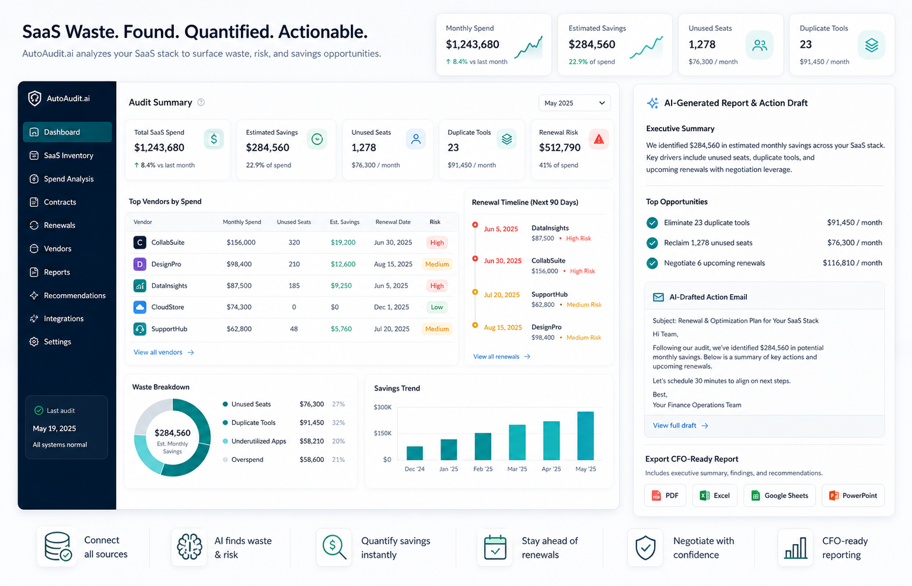
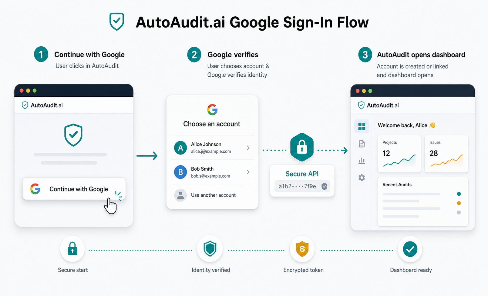

# AutoAudit.ai

Premium SaaS waste control for finance and operations teams.


AutoAudit.ai helps teams find forgotten software spend before it renews, prioritize the highest-value cleanup work, and turn vendor evidence into CFO-ready reports and action emails.

## What It Does

- Maps vendors to owners, categories, monthly spend, seats, usage, and renewal dates.
- Imports vendor CSVs for faster workspace setup.
- Detects zombie subscriptions, unused seats, duplicate tools, and renewal risk.
- Generates monthly SaaS waste reports and vendor cancellation or renegotiation drafts.
- Supports Google sign-in alongside email/password authentication.
- Supports owner, admin, and member roles with audit logs for sensitive actions.
- Ships as a protected dashboard-first SaaS workspace with responsive views.



## Tech Stack

- React, Vite, TypeScript
- Tailwind CSS, Recharts, lucide-react
- Node.js, Express, MongoDB, Mongoose
- JWT auth, Google OAuth, Helmet security headers, rate limiting

## Project Structure

```text
src/
  api/             Axios client and API service wrappers
  auth/            Auth context and session bootstrapping
  components/      Shared app components
  pages/           Auth and dashboard screens
  theme/           Theme provider
  types/           API TypeScript types
server/
  src/
    config/        Environment and database config
    controllers/   Route handlers
    middleware/    Auth, roles, rate limits, validation, errors
    models/        Mongoose models and indexes
    routes/        API route modules
    services/      AI and waste detection services
    utils/         Shared backend helpers
docs/              Deployment and architecture notes
```

## Local Development

Install dependencies:

```bash
npm install
```

Create a local environment file:

```bash
cp .env.example .env
```

Start MongoDB locally, then run the API:

```bash
npm run dev:api
```

Run the frontend:

```bash
npm run dev
```

The frontend is usually available at `http://localhost:5173`. The API defaults to `http://127.0.0.1:5000`.

## Environment

Use `.env.example`, `server/.env.example`, and `src/.env.example` as deployment templates.

Required backend variables:

- `MONGODB_URI`
- `JWT_SECRET`
- `JWT_EXPIRES_IN`
- `OPENAI_API_KEY`
- `OPENAI_MODEL`
- `CORS_ORIGIN`
- `APP_URL`
- `GOOGLE_CLIENT_ID`
- `GOOGLE_CLIENT_SECRET`
- `GOOGLE_OAUTH_REDIRECT_URL`
- `RATE_LIMIT_WINDOW_MS`
- `RATE_LIMIT_MAX`
- `AUTH_RATE_LIMIT_WINDOW_MS`
- `AUTH_RATE_LIMIT_MAX`
- `AI_RATE_LIMIT_WINDOW_MS`
- `AI_RATE_LIMIT_MAX`
- `CONTACT_ADMIN_EMAILS`
- `CONTACT_TO_EMAIL`
- `RESEND_API_KEY` optional, for contact-form email alerts
- `EMAIL_FROM` optional, for contact-form email alerts
- `STRIPE_SECRET_KEY` optional, for hosted Checkout and the billing portal
- `STRIPE_WEBHOOK_SECRET` optional, required for Stripe subscription activation webhooks
- `STRIPE_STARTER_PRICE_ID` optional, Starter subscription price
- `STRIPE_STANDARD_PRICE_ID` optional, Standard subscription price

Required frontend variable:

- `VITE_API_URL`
- `VITE_SITE_URL`

For local Google sign-in, add this authorized redirect URI to the Google Cloud OAuth client:

```text
http://127.0.0.1:5000/api/auth/google/callback
```

For production Google sign-in, add:

```text
https://autoaudit-io.onrender.com/api/auth/google/callback
```



## Key Routes

- `/`
- `/pricing`
- `/demo`
- `/contact`
- `/about-developer`
- `/privacy`
- `/terms`
- `/login`
- `/signup`
- `/oauth/google`

Protected:

- `/dashboard`
- `/dashboard/:section`

API:

- `POST /api/auth/signup`
- `POST /api/auth/login`
- `GET /api/auth/google`
- `GET /api/auth/google/callback`
- `GET /api/profile/me`
- `PATCH /api/profile/company-settings`
- `POST /api/billing/checkout`
- `POST /api/billing/portal`
- `POST /api/billing/webhook`
- `GET /api/vendors?page=1&limit=25&search=slack&status=active&category=Sales`
- `POST /api/vendors`
- `PATCH /api/vendors/:id`
- `DELETE /api/vendors/:id`
- `GET /api/subscriptions`
- `POST /api/subscriptions`
- `GET /api/audit/summary`
- `GET /api/renewals`
- `GET /api/audit-logs`
- `POST /api/ai/cancel-email`
- `POST /api/ai/renegotiate-email`
- `POST /api/ai/monthly-report`
- `POST /api/ai/vendor-analysis`
- `GET /api/reports`
- `POST /api/contact`
- `GET /api/contact`
- `PATCH /api/contact/:id`
- `POST /api/analytics`

## Production Readiness

The API includes:

- Helmet security headers
- CORS allow-listing
- JSON body size limits
- Global, auth, and AI route rate limits
- Input validation and ObjectId checks
- Role-based access controls
- Safer error responses with request IDs
- MongoDB indexes for common filters and sorts
- Audit logs for write actions
- Paginated list responses

Roles:

- `owner`: full workspace access, including destructive vendor actions.
- `admin`: manages vendors and subscriptions, and can view audit logs.
- `member`: reviews workspace data and runs standard analysis flows.

## Deployment

See [docs/DEPLOYMENT.md](docs/DEPLOYMENT.md) for Vercel frontend and Render backend instructions.

Short version:

- Vercel frontend: build command `npm run build`, output `dist`, set `VITE_API_URL`.
- Render backend: build command `npm install && npm run build:api`, start command `npm run start:api`, set backend environment variables.
- After deploying Vercel, copy the frontend origin into Render `CORS_ORIGIN` and `APP_URL`, without a page path like `/login`.

Deployment checklist:

- Vercel `VITE_API_URL` points to the Render API origin.
- Vercel `VITE_API_URL` does not end with a trailing slash.
- Render `CORS_ORIGIN` includes the Vercel frontend origin only, not `/login` or another page path.
- Render `APP_URL` points to the canonical Vercel frontend origin.
- Render `GOOGLE_OAUTH_REDIRECT_URL` points to `https://autoaudit-io.onrender.com/api/auth/google/callback`.
- Render has `MONGODB_URI`, `JWT_SECRET`, `OPENAI_API_KEY`, and rate-limit variables.
- Render has `CONTACT_ADMIN_EMAILS=exehassan62@gmail.com` and `CONTACT_TO_EMAIL=exehassan62@gmail.com`.
- Add `RESEND_API_KEY` and `EMAIL_FROM` when you want contact-form email alerts.
- Keep `vercel.json` deployed so Vercel serves React Router deep links like `/oauth/google` and `/dashboard`.
- After frontend changes, redeploy Vercel.
- After backend changes, redeploy Render.

## Verification

```bash
npx tsc -b
npm run build
```

If Vite fails locally with a Windows `spawn EPERM`, retry from a normal terminal with antivirus or controlled-folder restrictions disabled for the workspace.

## Roadmap

1. Saved CSV mapping templates and import history.
2. Gmail and Outlook renewal import.
3. SSO usage signal ingestion.
4. Billing integration and savings capture ledger.
5. Deeper analytics dashboard for conversion and activation.
